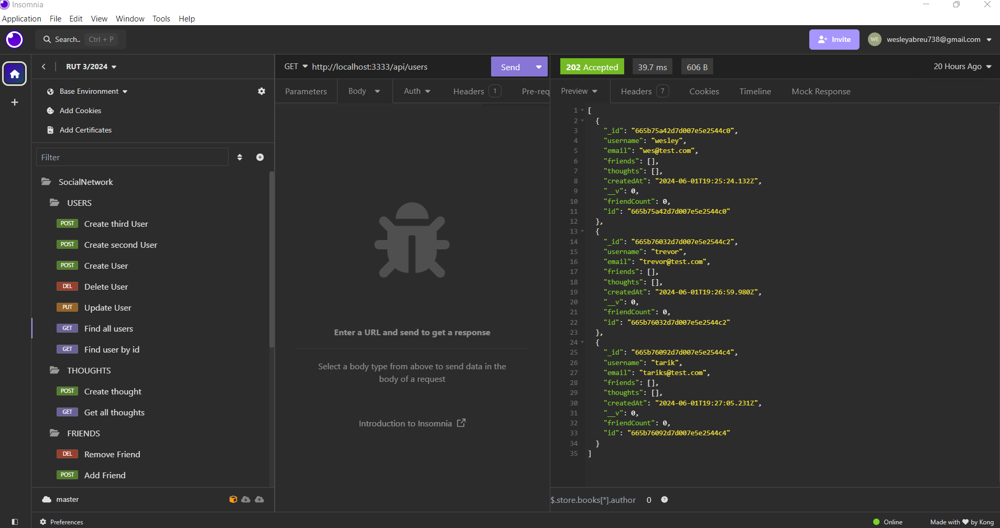
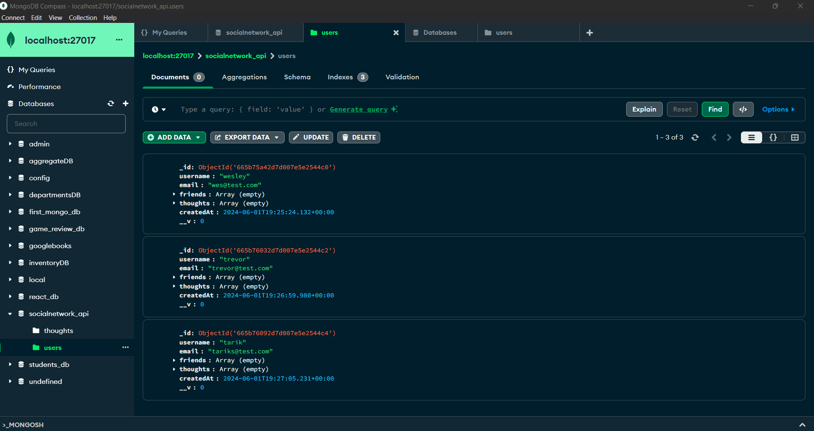

## SocialNetwork_API

## Table of Contents
- [Description](#description)
- [Visuals](#visuals)
- [Features](#features)
- [Installation](#installation)
- [Usage](#usage)
- [License](#license)
- [How to Contribute](#how-to-contribute)
- [Questions](#questions)

## Description
This Social Media Network API is designed to manage backend routes for a social media platform. The API allows for storing and managing user data, thoughts, reactions, and relational data between users such as friend lists and user thoughts. Built using modern web technologies, this API provides a robust backend service for social media applications.

Click here for a visual walkthrough. [Link](https://drive.google.com/file/d/1ITklAnZw_3efdt6PHZFi8oHJJLD52XPh/view?usp=sharing)
## Visuals

## Features
- CRUD operations for user data
- CRUD operations for thoughts
- CRUD operations for reactions
- Relationship management (friend lists, thoughts by a user)
- JSON responses for easy integration with frontend applications

## Installation
1. Clone the repository: `git clone <repository_url>`
2. Install dependencies: Within the terminal, run `npm install`

## Usage
1. Start the application: In the terminal, run `npm start`
2. Use a tool like Postman or Insomnia to interact with the API endpoints.
3. Use the API to create, read, update, and delete user data, thoughts, reactions, and manage relationships between users.

## License

This project is licensed under the MIT License. For more information on the license, please click the [Link](https://opensource.org/licenses/MIT).

## How to Contribute
Feel free to contribute to the project. If you would like more information, please check out the [Contributor Covenant](https://www.contributor-covenant.org/).

## Questions
For more information, check out my [GitHub](https://github.com/WAbreu738) 👋
